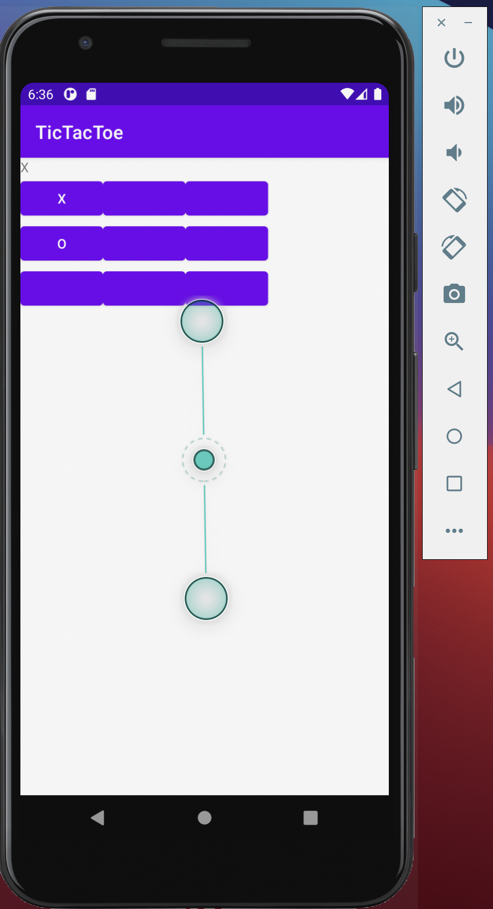
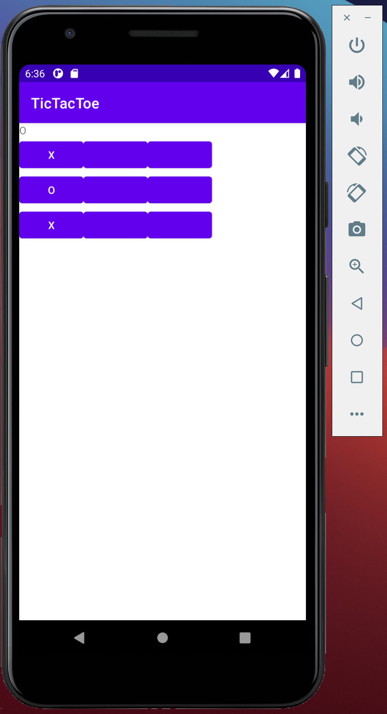
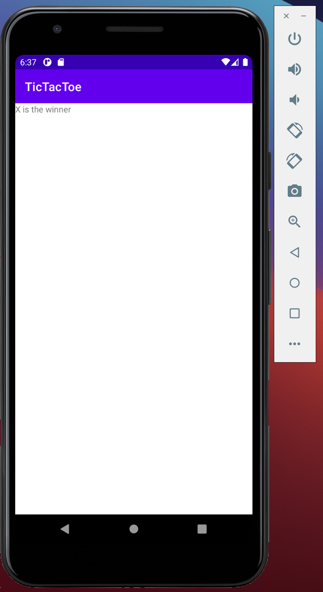

# Description
This is the clasic Tic tac toe

# Development Environment
* Android Studio
* JDK 15

# Execution
click "run" button

# Useful Sites
* [Stack Overflow](https://stackoverflow.com)
* [Kotlin Basic](https://www.programiz.com/kotlin-programming/input-output)
